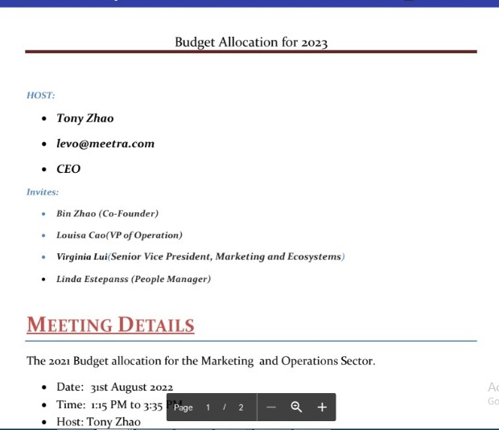

# Introduction
---
This is a productivity meeting website that uses the agora SDK with DjangoREST as the backend and React.js as the frontend

# Collaborators 
---
|    Name         |             Role(s)                 |    Discord         |        Email           |     Github     |  
|-----------------|:-----------------------------------:|:------------------:|:----------------------:|:--------------:|
| Bello Ango      | Project Manager/ Backend Developer  |  Krøn#7156         | angobello0@gmail.com   |     Grey-A     |
| Vincent Okereke | Frontend Developer                  | Pythoniclaver#8977 | vincentcode0@gmail.com |  pythoniclaver |
| Emmanuel Edor   | UI/UX Designer                      |     Maxe#8654      | emmeyboy9@gmail.com    |                |

# Project Demo
---
#### Click [here](# "Meetra Demo") to see a quick vimeo video where we use the website and [here](https://www.figma.com/file/ZU0c6dMLvkyQ1tbGZW0ut3/Meetra?node-id=28%3A565) to see the figma design

- Header

- Footer

- Signup

- Login

# How we acheived maximum productivity whilst in a video call
---
Our approach were these questions, 
- `how do we make meetings productive?` 
- `what exactly is productive?` 
- `and how do we increase productivity?`  
we came to two conclusions regarding this matter, **_`productive meetings arent necessarily long and productive meetings go straight to the point.`_**, so having this in mind we began searching for how to reduce the time our users spend in those meetings while addressing only the keypoints and this [article](https://fellow.app/blog/meetings/effective-strategies-to-shorten-meetings-at-work/ "Fellow App") helped us map out exactly how to do that. We designed our website with the objective of segmenting meetings in bullet points (Milestones as we call it), which represent goals our users want to acheive in a meeting.
# Key features of our website
---
- We help our clients by seperating each major talking point of their meetings into milestones.
- Each milestone will have a duration and a total max-time increment in case the milestone took longer to accomplish
- Our user will provide more detailed information about a milestone e.g. Team's budget allocation, which will be sent to the others involved as a sort of breif, e.g  

[Cick here to see the PDF](https://drive.google.com/file/d/1ZnK_Cr0izMff75Bt8PoNQ_38iuAvMPOF/view?usp=sharing)
 
- Host is able to alter meeting details from his dashboard at any time

# Resources
---
- Figma:
      We used this to make our mockup design with the low and high fidelity mockups and a case study, [Here is a link to view it](https://www.figma.com/file/ZU0c6dMLvkyQ1tbGZW0ut3/Meetra?node-id=28%3A565 "Meetra Figma Design")
- React.js:
      We used this as our Frontend framework.
- DjangoREST Framework:
      We used this as our backend API with an SQLite3 Database to support it
- Lucid Charts:
      We used this to make a visualization on how our Databases relate with each other, [Here is a link to view it](https://lucid.app/lucidchart/6f61d1d6-71ea-49d5-89d9-e8f7a9c28ace/edit?beaconFlowId=8D64D449961BBA3E&invitationId=inv_421214e3-ce3d-4937-b315-b14649439817&page=0_0# "Meetra Lucid Chart")
- PostMan:
      We used this to test our Backend API, [Here is a link to the Postman website](https://www.postman.com/ "Postman Website")
- [Breifs Demo PDF](https://drive.google.com/file/d/1ZnK_Cr0izMff75Bt8PoNQ_38iuAvMPOF/view?usp=sharing)
- [Case Study PDF](https://drive.google.com/file/d/1x7p-nKpdCJOt3dGtVCkweBBnpU5dhufH/view?usp=sharing)

# Difficulties we Faced
---
Here are some of the difficulties me and my team faced in this project:
- **`Frontend`**: our frontend developer had issues with dynamically rendering react components, he said creating reusable components and keeping track of state gave him                 quite a bit of a headache for some time.
- **`Design`**: our designer had some issues coming up with an initial sketch for the website, he found it hard to come up with a frame for the meeting page and the dashboard.
- **`Backend`**: At the backend the major issue i faced was understanding and mapping out the api endpoints my front end developer needs and making sure it delivers an                  accurate and easy to understand response whilst making sure we made the least amount of api calls to the backend as we can.
- **`Integrating the Agora SDK`**: Customizing how our video streams will look like gave us quite a headache that we had to skip it.
- **`Issues i faced as Project Manager`**: The main problem i faced at first was co-ordinating the team so that we do everything at sync and everyone knows what others ar currently working on but overtime as i got more familiar with my team it became alot easy. 

# #Contact the team
--
For any enquiries or if you want to contact the team you can do this through the Project manager, **`Bello Ango`**
